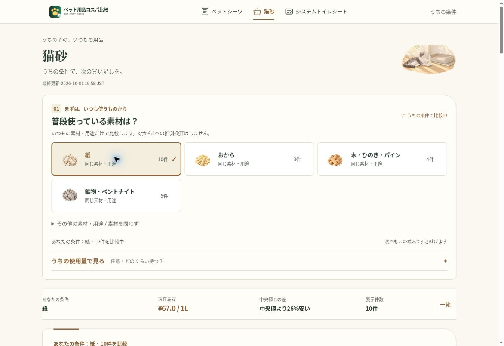

# 編集イラスト公開確認 — 2026-10-01

## 変更範囲

現行UI、コピー、レイアウト、比較エンジンを維持。簡易SVGの `care_art()` を正式なWebP画像18点へ置換した。ホーム3場面、カテゴリ上部3派生構図、条件選択12図版。既存メインビジュアルと `icon()` の操作記号は維持。

詳細な資産一覧、制作方式（組み込み画像生成）、使用プロンプト、クロップ仕様は [制作仕様](editorial-art-direction.md)。新規WebP合計298,388バイト、最大29,972バイト。画像に幅・高さを指定し、元の4:3表示領域を保つ。

## 公開ブラウザーでの確認

ChromeのPC幅と390×844pxのiPhone相当表示領域で、ホーム、全カテゴリ上部、全条件カードを実際に操作・目視確認した。Safari実機の確認ではない。

- ペットシーツ：レギュラー、ワイド、スーパーワイド。
- 猫砂：紙、おから、木、鉱物、素材を問わず、混合素材、システムトイレ用。
- システムトイレ：デオトイレ系、ニャンとも系、各社共通。
- 全13条件で選択状態、表示件数、最安、TOP3と商品順位の一致、安さの理由、画像の読み込みと寸法を確認。
- システムトイレで週1枚を入力し、240枚=約240週間分・30日約373円を確認。支払総額の候補では20枚=約20週間分・30日約375円。単価、総額、容量の3つの切替を確認。
- 店頭980円÷20枚=49円/枚、掲載最安87円/枚との差を確認。
- 楽天アフィリエイトリンクを実際に開き、対応する楽天商品ページへの遷移を確認。
- GA4タグ G-GFVSZ8YDQ5、canonical、JSON-LDを公開DOMで確認。イベント名と計測実装は変更なし。GA4管理画面での受信確認は行っていない。

## 自動検証・公開

Python 33テスト、DOM 15テストが成功。商品品質監査は公開データを再利用して再構築した62商品（シーツ22、猫砂30、システムトイレ10）で成功。取得・品質判定・分類・数量解析・単価計算・Secrets・SEO・更新ワークフロー・Pages競合対策には変更なし。

初回実装PR #33のValidate comparison UI、Build and deploy pet-cost-jp、生成後のPages公開がすべて成功。公開サイトで `editorial-art-1` 資産を確認。スマホ幅検証用の一時HTMLは確認後に削除する。
