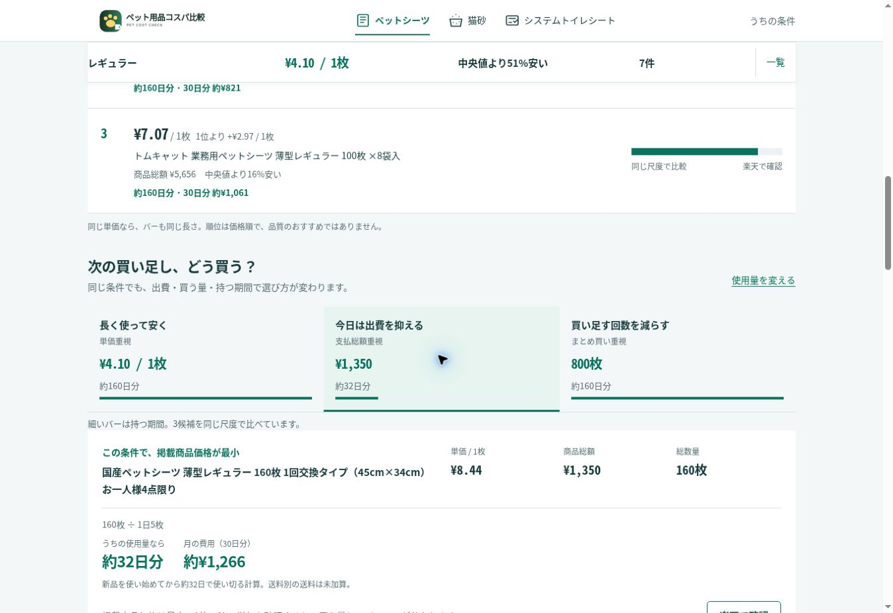

# うちの条件・使用量比較の最終公開確認

公開URL：https://stusaurus.github.io/pet-cost-jp/

PR #29（条件と任意使用量）と #30（スマホの調整・確認用ページ削除）をマージ。最終公開のmainは e62f238edc50602f26c3b16fe6cfaf56d41b3066。2026-10-01 08:06 JSTの公開データは61商品（ペットシーツ22、猫砂30、システムトイレシート9）。自動取得に伴い、初回の62件から更新された。

## 検証結果

- PCと390×844で全3カテゴリ・全13表示条件を実際に操作。
- 初回の条件回答前は価格結果を表示しない。条件回答後は最安・TOP3・一覧・理由・固定サマリーが連動。前回の条件と使用量も復元。
- 800枚/日5枚＝160日・30日615円、42L/月10L＝4.2か月・約595円、20枚/週1枚＝20週間・30日375円の公開データで換算一致。
- 買い方ごとの持つ期間を比較し、使用量の0拒否、解除後も単価比較が続くことを確認。
- スマホで一覧1〜5位・楽天ボタン・下部ナビ・固定サマリーの縮小をスクロール確認。
- 店頭980円/20枚＝49円、PCの全角1,000円/20枚＝50円を確認。店頭比較は選んだ条件との補助比較。
- 楽天アフィリエイトを実際にクリックし、指定商品の商品ページへ到着。
- GA4公開Measurement IDを確認。既存10イベント、新設 pet_category_select / pet_usage_change はDOMテストで送信と重複抑制を確認。使用量の数値は新イベントへ送らない。
- Python29件・DOM14件成功。最終の61商品でも同じチェックと商品品質監査を再実行し成功。
- PR検証Actions：36787959344 / 36789154541 成功。
- 最終本番Actions：36789302779 は取得・テスト・商品品質監査・Pages公開の全ステップ成功。
- mainミラーのPages：36789366814 成功。公開URLで最終見出し・使用量リンク・結果を確認。
- 一時確認用assets/household-qa.htmlは公開mainから削除済み。既存のSEO、Secrets、取得・分類・単価計算、競合対策、更新スケジュールを維持。

実機SafariとGA4管理画面での集計は未検証。送料別商品の送料額は楽天で最終確認する仕様を維持。

