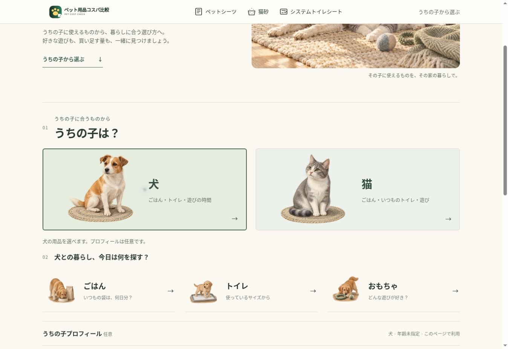

# ペット起点の用品選び：公開確認

## 今回の判断

既存の条件比較・使用量計算は有用だった一方、トップはトイレ消耗品3種の入口に限られ、その子のごはんや遊びを探す導線がなかった。プロフィールと価格順位を混同せず、犬猫を選ぶ → 用品 → 必要な条件 → 候補・暮らしの数字、という構造を追加した。

日用品版の価格検索・価格判定とは異なり、個体と家庭の条件を先に確認する。既存の条件が決まっている人には直接比較を残し、重複する入口の見出しを「いつもの用品をすぐ比べる」に整理した。

## 実装範囲

- 犬3入口、猫4入口。ごはん・遊び・既存トイレ用品へ段階的に進む。
- 任意プロフィール：犬猫の年齢、犬の現在の体格、体重、犬種・猫種。犬種・猫種は任意テキスト入力。体重・種類から商品適合や給与量を推測しない。
- プロフィール保存はチェックした場合だけ。犬猫ごとに分けて復元し、保存不可でもページ内で利用可能。既存の条件・使用量の記憶を維持。
- 犬猫両フード：入力した内容量・価格・1日量から日数、1日と30日の費用、100g・1kg単価へ換算。商品比較はメーカーSKU照合が済むまで掲載保留。
- おもちゃ：遊び方を選ぶ発見体験。個別照合済みの犬1件・猫1件から開始。価格順位は付けない。年齢未確認の候補は年齢指定時に除外し、サイズ不一致も除外する。
- 比較ロジック、TOP3、3つの買い方、理由表示、店頭比較、楽天URL、数量解析、分類、重複排除、Secrets、既存イベント、SEO、自動更新、Pages競合対策は維持。

## アート

新しいガッシュ・色鉛筆感の編集イラストを6枚のマスターから28点の正式WebPへ展開。朝の光、生成り・セージ・淡い青を統一。犬猫を擬人化しない。サイズと年齢の選択図版、遊び道具にも同じ画材感を使う。

`care_art()` はホーム用品とカテゴリ上部を新シリーズへ切り替え、機能的に良かった既存の素材・サイズ・本体図版は維持。小さな `icon()` の線画SVGも維持。OG/Twitter画像も新しいメインビジュアルへ統一。幅・高さを指定し、画像は遅延読み込みとWebPで配信。

制作モード、全プロンプト、マスターと切り出しの根拠は [pet-living-art.md](pet-living-art.md) と `assets/living/manifest.json` に記録。

## 検証結果

- Python 37件、DOM操作19件、合計56件成功。
- 既存63商品（シーツ23・猫砂30・システムシート10）と新しいおもちゃ2件、合計65商品が品質監査を通過。フード商品は0件の掲載保留。
- 公開PC・390×844pxのiPhone相当幅で犬猫導線、プロフィール、全7カテゴリを確認。実機Safariの検証ではない。
- 既存3カテゴリ・全13条件をPCとスマホで操作。最安、件数、順位、理由、固定サマリー、TOP3と3つの買い方の同期を確認。
- シーツ800枚・1日5枚 → 約160日、30日約615円。猫砂60L・月10L → 約6か月、月約670円。システムシート240枚・週1枚 → 約240週、30日約373円。
- 犬猫フード2,000g・3,000円・1日120g → 約16.7日、1日約180円、30日約5,400円。無効値はエラー表示。
- 店頭計算を3カテゴリで確認。楽天のアフィリエイトリンクが対応商品ページに到達することを確認。
- プロフィールの保存・再読込・削除、候補がない状態、未確認年齢と不一致サイズの除外を確認。
- 猫じゃらし画像の一時読み込み失敗は再表示で解消。PC・スマホで正常表示を確認し、切り出しの隣の絵も最終調整した。
- GA4タグ、canonical、構造化データ、sitemapを維持。既存計測の回帰テストと新イベント発火テストを実施。GA4管理画面の受信レポートは今回確認していない。
- 新イベント：`pet_species_select`、`pet_supply_select`、`pet_profile_change`、`pet_profile_clear`、`pet_play_select`、`pet_food_calculator_use`。体重・犬種・猫種や計算入力値を送信しない。
- PR #35・#36のCIとmainのBuild/deploy成功。公開済みのPagesでも確認。最終整理PRでは確認用noindexページを削除する。

## 次段階

フードのメーカーSKU照合と同条件商品比較、遊び候補の拡充、犬種・猫種の主要候補イラスト選択。健康条件への自動推薦や独自給与量推定は追加しない。おもちゃの個別確認は180日で失効し、表記変更時も再照合する。

